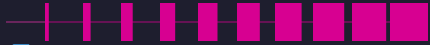

## sample bar
```<:dziesi:1219277713525964860><:dziesi:1219277713525964860><:dziesi:1219277713525964860><:dziesi:1219277713525964860><:dziesi:1219277713525964860><:cztery:1219277705300803680><:zero:1219277173014270052><:zero:1219277173014270052><:zero:1219277173014270052><:zero:1219277173014270052>
```


## sample embed


```json
{
  "content": null,
  "embeds": [
    {
      "title": "You Are 54% of the way to level 6",
      "description": "<:dziesi:1219277713525964860><:dziesi:1219277713525964860><:dziesi:1219277713525964860><:dziesi:1219277713525964860><:dziesi:1219277713525964860><:cztery:1219277705300803680><:zero:1219277173014270052><:zero:1219277173014270052><:zero:1219277173014270052><:zero:1219277173014270052>\n\n**45**/83 xp",
      "color": 16753408
    }
  ],
  "username": "photo ayumi bot test",
  "attachments": []
}
```

# All emojis


```
<:zero:1219277173014270052><:jeden:1219277208929959937><:dwa:1219277207550169129><:trzy:1219277704277528586><:cztery:1219277705300803680><:pi:1219277706558963756><:sze:1219277708467376128><:siedem:1219277709579128843><:osiem:1219277711172698113><:dziewi:1219277712384856254><:dziesi:1219277713525964860>
```

